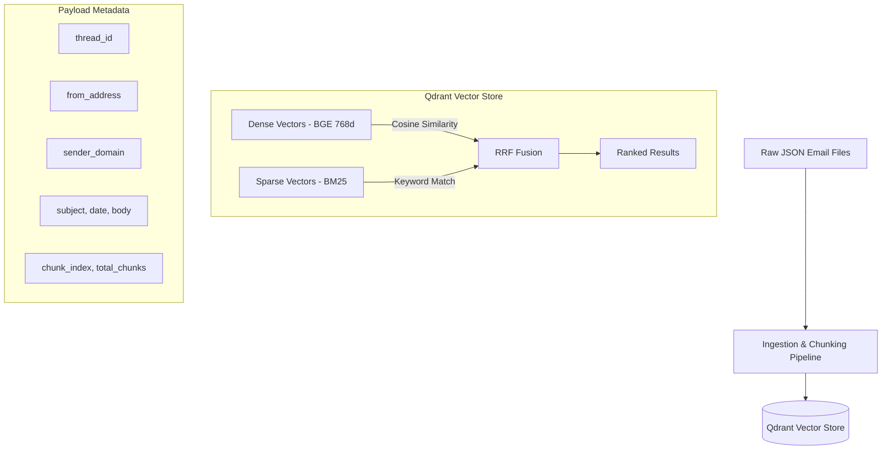

<div align="center">

# CorpusIQ

### AI-Powered Enterprise Email Intelligence Platform

**Hybrid RAG · Cross-Encoder Reranking · Thread-Aware Context · Multi-LLM Synthesis**

[](https://python.org)
[](https://fastapi.tiangolo.com)
[](https://qdrant.tech)
[](LICENSE)

</div>

---

## Overview

CorpusIQ is a production-grade **Retrieval-Augmented Generation (RAG)** platform built for enterprise email intelligence. It ingests the [Enron Email Dataset](https://www.kaggle.com/datasets/wcukierski/enron-email-dataset) (~500K emails), indexes content into a dual-vector store with hybrid search, and delivers grounded, citation-backed answers through a multi-stage retrieval pipeline.

The system demonstrates modern AI engineering principles — **streaming ingestion**, **hybrid dense + sparse retrieval**, **cross-encoder reranking**, **thread-aware context expansion**, and **multi-provider LLM synthesis** — all running on CPU without GPU dependencies.

---

## Key Features

| Category | Capability |
|---|---|
| **Ingestion** | Memory-efficient streaming JSON parser via `ijson` with configurable batch sizes |
| **Chunking** | Thread-aware sliding window chunker with header enrichment and configurable overlap |
| **Embeddings** | Local 768-dim dense embeddings (`BAAI/bge-base-en-v1.5`) via FastEmbed on CPU |
| **Hybrid Search** | Dual-vector Qdrant store with dense cosine + BM25 sparse retrieval fused via RRF |
| **Reranking** | Cross-encoder reranker (`BAAI/bge-reranker-base`) for precision refinement |
| **Thread Expansion** | Automatic parent-thread context injection for conversational coherence |
| **LLM Synthesis** | Multi-provider support (Groq / OpenRouter / OpenAI) with structured citation output |
| **Observability** | JSON-structured logging with environment-aware formatters (dev/prod) |
| **Schemas** | Fully typed Pydantic v2 models across the entire pipeline |

---

## Architecture

### High-Level System Flow

```
                    ┌──────────────────────────────────────────────┐
                    │              CorpusIQ Pipeline               │
                    └──────────────────────────────────────────────┘

  ┌─────────────┐     ┌──────────────┐     ┌──────────────────────┐
  │  Raw JSON   │────▶│  Streaming   │────▶│  Pydantic v2 Schema  │
  │  Email File │     │  Ingestion   │     │  Validation          │
  └─────────────┘     │  (ijson)     │     └──────────┬───────────┘
                      └──────────────┘                │
                                                      ▼
                ┌─────────────────────────────────────────────────┐
                │          Thread-Aware Email Chunker             │
                │   (Sliding Window + Header Enrichment)         │
                └──────────────────────┬──────────────────────────┘
                                       │
              ┌────────────────────────┼────────────────────────┐
              ▼                        ▼                        ▼
   ┌──────────────────┐   ┌──────────────────┐   ┌──────────────────┐
   │  Dense Embeddings│   │  BM25 Sparse     │   │  Payload Metadata│
   │  BGE-base 768d   │   │  Qdrant/bm25     │   │  Indexed Fields  │
   └────────┬─────────┘   └────────┬─────────┘   └────────┬─────────┘
            └──────────────────────┼────────────────────────┘
                                   ▼
                    ┌──────────────────────────────┐
                    │     Qdrant Vector Store       │
                    │  (Dual-Vector + RRF Fusion)   │
                    └──────────────┬───────────────┘
                                   │
                                   ▼  (Query Time)
                    ┌──────────────────────────────┐
                    │   Hybrid RRF Candidate Pool   │
                    │   (Dense + BM25 → Top K×2)    │
                    └──────────────┬───────────────┘
                                   │
                                   ▼
                    ┌──────────────────────────────┐
                    │   Cross-Encoder Reranking     │
                    │   (BGE-reranker-base → Top N) │
                    └──────────────┬───────────────┘
                                   │
                                   ▼
                    ┌──────────────────────────────┐
                    │    Thread Context Expansion   │
                    │   (Parent Thread Injection)   │
                    └──────────────┬───────────────┘
                                   │
                                   ▼
                    ┌──────────────────────────────┐
                    │      LLM Synthesis Layer      │
                    │  (Groq / OpenRouter / OpenAI) │
                    └──────────────┬───────────────┘
                                   │
                                   ▼
                    ┌──────────────────────────────┐
                    │  Grounded Answer + Citations  │
                    └──────────────────────────────┘
```

### Data Model (Mermaid)



---

## Pipeline Stages (In-Depth)

### Stage 1 — Streaming Ingestion

The ingestion layer uses `ijson` for **constant-memory streaming** over multi-GB JSON files. Each email is parsed, validated against a strict Pydantic v2 schema (`EmailMessage`), and yielded as part of configurable batches.

- **Module**: `app/ingestion/json_streamer.py` → `JsonStreamer`
- **Orchestrator**: `app/ingestion/pipeline.py` → `IngestionPipeline`
- **Design**: Abstract `BaseIngestor` interface for extensibility
- **Metrics**: Real-time throughput tracking (`IngestionMetrics` with msg/sec)

### Stage 2 — Thread-Aware Chunking

Emails are chunked using a **sliding window strategy** with header enrichment — each chunk begins with structured metadata (Subject, From, To, Date) followed by the body content. This ensures every chunk is self-contained for retrieval.

- **Module**: `app/rag/chunker.py` → `EmailChunker`
- **Config**: `max_chunk_chars=1500`, `overlap_chars=150`
- **Metadata**: `thread_id`, `message_id`, `is_thread_root`, `sender_domain`, `chunk_index`

### Stage 3 — Dual-Vector Embedding

Each chunk is embedded into **two vector spaces simultaneously**:

| Vector Type | Model | Dimensions | Purpose |
|---|---|---|---|
| **Dense** | `BAAI/bge-base-en-v1.5` | 768 | Semantic similarity |
| **Sparse** | `Qdrant/bm25` | Variable | Keyword/lexical match |

Both run locally on CPU via **FastEmbed** with ONNX Runtime — no GPU required.

- **Dense Module**: `app/rag/embeddings.py` → `BGEMbeddingEngine`
- **Sparse**: Integrated in `app/rag/vector_store.py` via `SparseTextEmbedding`

### Stage 4 — Qdrant Hybrid Vector Store

Chunks are stored in **Qdrant** with dual named vectors (`dense` + `bm25`). The collection is configured with:

- **Payload indexes** on `thread_id`, `from_address`, `sender_domain`, `is_thread_root`, and `thread_position` for filtered retrieval
- **Deterministic IDs** via UUID5 hashing on `chunk_id` for idempotent upserts
- **On-disk sparse indexes** for memory-efficient BM25

### Stage 5 — Hybrid RRF Search

At query time, Qdrant executes **two parallel prefetch queries** (dense + BM25), each retrieving `top_k × 2` candidates. Results are fused using **Reciprocal Rank Fusion (RRF)** — a rank-based aggregation method that combines both retrieval signals without requiring score calibration.

Optional filters: `from_address`, `thread_id`, `sender_domain`

### Stage 6 — Cross-Encoder Reranking

The RRF candidate pool is refined by a **cross-encoder model** (`BAAI/bge-reranker-base`) that jointly scores `(query, document)` pairs. This provides significantly higher precision than bi-encoder similarity alone.

- **Module**: `app/rag/reranker.py` → `CrossEncoderReranker`
- **Default**: Rerank `20` candidates → return `Top 5`

### Stage 7 — Thread Context Expansion

For non-root emails (replies), the system **fetches the thread root** from Qdrant and prepends it to the context window. This gives the LLM full conversational context without requiring the user to specify thread details.

- **Module**: `app/rag/thread_expander.py` → `ThreadExpander`

### Stage 8 — LLM Synthesis & Citations

The final context is formatted with structured document headers and sent to an LLM for grounded answer generation. The system prompt enforces **source citation** (Thread ID + Sender) and factual grounding.

- **Module**: `app/rag/synthesizer.py` → `RAGSynthesizer`
- **Provider Priority**: Groq → OpenRouter → OpenAI (fallback to retrieval-only mode if no key)
- **Output**: `RAGQueryResponse` with `answer` + `sources[]` (chunk_id, score, thread_id, subject, from, date)

---

## Tech Stack

| Layer | Technology | Purpose |
|---|---|---|
| **Framework** | FastAPI | Async REST API with automatic OpenAPI docs |
| **Embeddings** | FastEmbed + ONNX Runtime | CPU-native BGE-base-en-v1.5 (768d) |
| **Sparse Search** | FastEmbed BM25 | CPU-native BM25 sparse vectors |
| **Vector DB** | Qdrant (embedded mode) | Dual-vector store with RRF fusion |
| **Reranker** | FastEmbed CrossEncoder | BAAI/bge-reranker-base on CPU |
| **LLM** | OpenAI SDK (multi-provider) | Groq / OpenRouter / OpenAI compatible |
| **Schemas** | Pydantic v2 | Strict typed models across pipeline |
| **Streaming** | ijson | Constant-memory JSON parsing |
| **Logging** | Python `logging` + JSON formatter | Structured observability |
| **Config** | pydantic-settings + dotenv | Environment-based configuration |
| **Database** | PostgreSQL + SQLAlchemy (planned) | Relational metadata storage |
| **Caching** | Redis (planned) | Query caching and rate limiting |
| **PII** | Presidio + spaCy (planned) | Detection and redaction pipeline |
| **MCP** | MCP Python SDK (planned) | Model Context Protocol server |

---

## Project Structure

```
CorpusIQ/
├── backend/
│   ├── app/
│   │   ├── __init__.py              # Package init: exports settings, logger
│   │   ├── main.py                  # FastAPI application entrypoint
│   │   ├── core/
│   │   │   ├── config.py            # Pydantic Settings (env vars, paths)
│   │   │   └── logger.py            # JSON/dev-aware structured logging
│   │   ├── ingestion/
│   │   │   ├── base.py              # Abstract BaseIngestor interface
│   │   │   ├── json_streamer.py     # ijson streaming parser + Pydantic validation
│   │   │   └── pipeline.py          # Batched ingestion orchestrator with metrics
│   │   ├── rag/
│   │   │   ├── chunker.py           # Sliding window chunker with header enrichment
│   │   │   ├── embeddings.py        # BGE-base-en-v1.5 dense embedding engine
│   │   │   ├── vector_store.py      # Qdrant dual-vector store (dense + BM25)
│   │   │   ├── reranker.py          # Cross-encoder reranker (bge-reranker-base)
│   │   │   ├── thread_expander.py   # Parent-thread context expansion
│   │   │   ├── synthesizer.py       # Multi-provider LLM synthesis + citations
│   │   │   └── pipeline.py          # 7-stage RAG pipeline orchestrator
│   │   ├── schemas/
│   │   │   ├── email.py             # EmailMessage & EmailThread models
│   │   │   ├── rag_schema.py        # RAGChunk, RAGQueryRequest/Response models
│   │   │   └── ingestion_schema.py  # IngestionMetrics model
│   │   ├── db/
│   │   │   ├── models/              # SQLAlchemy ORM models (planned)
│   │   │   └── repositories/        # Data access layer (planned)
│   │   ├── services/                # Business logic layer (planned)
│   │   ├── v1/api/endpoints/        # Versioned REST endpoints (planned)
│   │   └── tests/
│   │       └── check_env.py         # Environment configuration validator
│   ├── scripts/
│   │   └── index_full_dataset.py    # Production indexing script (10K emails)
│   ├── tests/
│   │   ├── test_ingestion.py        # Ingestion pipeline integration test
│   │   └── test_full_rag.py         # End-to-end RAG pipeline test
│   ├── storage/
│   │   └── qdrant_db/               # Embedded Qdrant persistent storage
│   ├── notebooks/                   # Jupyter exploration notebooks
│   ├── requirements.txt             # Python dependencies
│   ├── pyproject.toml               # Project metadata
│   └── .env.example                 # Environment template
├── frontend/                        # React frontend (planned)
├── datasets/                        # Enron Email Dataset (gitignored)
├── docs/                            # Project documentation
├── .gitignore
└── README.md
```

---

## Getting Started

### Prerequisites

- Python 3.11+
- pip

### 1. Clone the Repository

```bash
git clone https://github.com/Saif907/CorpusIQ.git
cd CorpusIQ
```

### 2. Setup Backend

```bash
cd backend

# Create and activate virtual environment
python -m venv venv

# Windows
venv\Scripts\activate

# Linux/macOS
source venv/bin/activate

# Install dependencies
pip install -r requirements.txt
```

### 3. Configure Environment

```bash
cp .env.example .env
# Edit .env with your API keys (at least one LLM provider)
```

### 4. Download Dataset

Download the [Enron Email Dataset](https://www.kaggle.com/datasets/wcukierski/enron-email-dataset) and place the preprocessed `threaded_emails.json` file in `datasets/Enron_Email_Dataset/`.

### 5. Index the Dataset

```bash
# Index 10,000 emails into Qdrant (runs on CPU)
python scripts/index_full_dataset.py
```

### 6. Run Tests

```bash
# Test ingestion pipeline
python tests/test_ingestion.py

# Test full RAG pipeline (end-to-end)
python tests/test_full_rag.py
```

### 7. Start the API Server

```bash
uvicorn app.main:app --reload
```

---

## Example Query & Response

```python
from app.rag.pipeline import RAGPipeline

pipeline = RAGPipeline()

response = pipeline.query(
    query_text="What updates were shared about the Guggenheim event?",
    candidate_k=20,
    rerank_top_n=5,
    enable_thread_expansion=True
)

print(response.answer)
# → Grounded answer with Thread ID and sender citations

for src in response.sources:
    print(f"  [{src['score']}] {src['subject']} — {src['from_address']}")
```

---

## Design Decisions

| Decision | Rationale |
|---|---|
| **FastEmbed over Sentence-Transformers** | ONNX-backed CPU inference — 3-5× faster on CPU, no PyTorch dependency bloat |
| **Qdrant embedded mode** | Zero-infra local development; seamless transition to Qdrant Cloud for production |
| **RRF over learned fusion** | Robust rank-based fusion that doesn't require score calibration between dense and sparse retrievers |
| **Cross-encoder reranking** | Joint query-document scoring provides significantly better precision than bi-encoder cosine alone |
| **Thread expansion** | Email conversations lose critical context without the parent message — expansion solves this |
| **ijson streaming** | Constant O(1) memory regardless of dataset size — critical for the 1.3GB Enron dataset |
| **Multi-provider LLM** | Graceful degradation: Groq (free/fast) → OpenRouter → OpenAI → retrieval-only fallback |
| **Pydantic v2 schemas** | Type safety across the entire pipeline with zero-cost serialization via Rust core |

---

## Development Roadmap

### ✅ Version 1 — Core RAG Pipeline (Current)
- [x] Streaming JSON ingestion with ijson
- [x] Pydantic v2 email schema validation
- [x] Thread-aware sliding window chunking
- [x] Dense embeddings (BGE-base, 768d)
- [x] BM25 sparse embeddings
- [x] Qdrant dual-vector store with RRF fusion
- [x] Cross-encoder reranking
- [x] Thread context expansion
- [x] Multi-provider LLM synthesis with citations
- [x] Structured JSON logging
- [x] Integration tests

### 🚧 Version 2 — Production Hardening
- [ ] FastAPI REST endpoints (search, ingest, health)
- [ ] PostgreSQL metadata storage with SQLAlchemy
- [ ] PII detection & redaction (Presidio + spaCy)
- [ ] Redis query caching & rate limiting
- [ ] Agentic AI workflows
- [ ] MCP (Model Context Protocol) server
- [ ] Audit logging

### 🔮 Version 3 — Enterprise Features
- [ ] OCR support for scanned PDFs
- [ ] React frontend dashboard
- [ ] Multi-agent workflows
- [ ] Advanced compliance analysis
- [ ] Deployment (Docker + CI/CD)

---

## Environment Variables

| Variable | Required | Description |
|---|---|---|
| `GROQ_API_KEY` | One LLM key required | Groq API key (recommended — free tier) |
| `GROQ_MODEL` | No | Groq model name (default: `llama-3.3-70b-versatile`) |
| `OPENROUTER_API_KEY` | One LLM key required | OpenRouter API key |
| `OPENROUTER_MODEL` | No | OpenRouter model (default: `openai/gpt-4o-mini`) |
| `OPENAI_API_KEY` | One LLM key required | OpenAI API key |
| `OPENAI_MODEL` | No | OpenAI model name |
| `ENV` | No | `development` or `production` (controls logging format) |
| `INGESTION_BATCH_SIZE` | No | Batch size for ingestion streaming (default: `100`) |
| `INGESTION_MAX_WORKERS` | No | Concurrency limit for ingestion (default: `4`) |

> **Note**: At least one LLM provider key is needed for synthesis. Without any key, the system operates in **retrieval-only mode** — returning ranked search results without LLM-generated answers.

---

## License

This project is licensed under the [MIT License](LICENSE).

---

<div align="center">
<sub>Built with focus on production-grade AI system design.</sub>
</div>